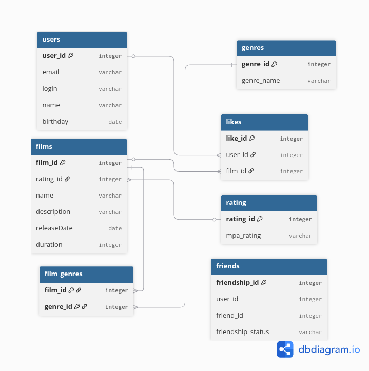

# java-filmorate
Template repository for Filmorate project.

## Схема базы данных



## Примеры запросов к БД

# Все фильмы с их MPA-рейтингом
```
SELECT
f.film_id,
f.name,
r.mpa_rating
FROM films AS f
JOIN rating AS r ON f.rating_id = r.rating_id;
```

# Все жанры конкретного фильма с id 1
```
SELECT
    g.genre_name
FROM film_genres AS fg
JOIN genres AS g ON fg.genre_id = g.genre_id
WHERE fg.film_id = 1;

```

# Топ-5 самых популярных фильмов по количеству лайков
```
SELECT
    f.film_id,
    f.name,
    COUNT(l.like_id) AS likes_count
FROM films AS f
LEFT JOIN likes AS l ON f.film_id = l.film_id
GROUP BY f.film_id, f.name
ORDER BY likes_count DESC
LIMIT 5;
```